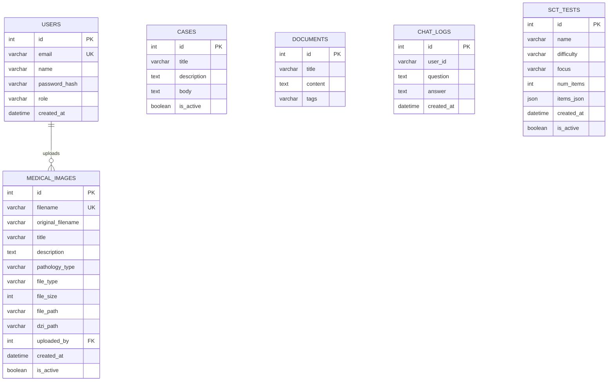

# Informe de Base de Datos - Asofamech

Este informe describe la base de datos usada por el proyecto Asofamech, sus clases SQLAlchemy, las tablas generadas, sus relaciones y las consultas principales usadas por el backend.

## 1. Resumen General

El proyecto usa:

- Motor de base de datos: PostgreSQL 15
- ORM: SQLAlchemy
- Framework backend: FastAPI
- Archivo de conexion: `backend/app/db.py`
- Archivo de modelos/tablas: `backend/app/models.py`
- Creacion de tablas: `Base.metadata.create_all(bind=engine)` en `backend/app/main.py`

No se encontro una carpeta de migraciones tipo Alembic. Las tablas se crean automaticamente al iniciar el backend, segun las clases declaradas en `models.py`.

Conexion configurada en Docker:

```text
DATABASE_URL=postgresql://app_user:app_pass@db:5432/app_db
```

Conexion local desde el host:

```text
Host: localhost
Port: 5432
Database: app_db
User: app_user
Password: app_pass
```

## 2. Tablas Detectadas

Las clases SQLAlchemy definen estas tablas:

| Clase Python | Tabla BD | Proposito |
|---|---|---|
| `User` | `users` | Usuarios del sistema |
| `MedicalImage` | `medical_images` | Imagenes medicas subidas al sistema |
| `Case` | `cases` | Casos clinicos usados por busqueda y chat/RAG |
| `Document` | `documents` | Documentos de texto para posible RAG |
| `ChatLog` | `chat_logs` | Historial de preguntas y respuestas |
| `SCTTest` | `sct_tests` | Tests SCT generados y guardados |

## 3. Relacion Principal

La unica relacion formal declarada en SQLAlchemy es:

```text
users.id 1 ---- N medical_images.uploaded_by
```

Interpretacion:

- Un usuario puede subir muchas imagenes medicas.
- Cada imagen medica puede estar asociada a un usuario uploader.
- La relacion se declara con `ForeignKey("users.id")`.
- En Python se navega asi:
  - `user.uploaded_images`
  - `medical_image.uploader`

No hay relaciones formales declaradas para `cases`, `documents`, `chat_logs` o `sct_tests`.

## 4. Diagrama ER Simple

```text
+----------------+          +----------------------+
| users          |          | medical_images       |
|----------------|          |----------------------|
| id PK          |<---------| uploaded_by FK       |
| email UNIQUE   |          | id PK                |
| name           |          | filename UNIQUE      |
| password_hash  |          | original_filename    |
| role           |          | title                |
| created_at     |          | description          |
+----------------+          | pathology_type       |
                            | file_type            |
                            | file_size            |
                            | file_path            |
                            | dzi_path             |
                            | created_at           |
                            | is_active            |
                            +----------------------+

+----------------+     +----------------+     +----------------+     +----------------+
| cases          |     | documents      |     | chat_logs      |     | sct_tests      |
|----------------|     |----------------|     |----------------|     |----------------|
| id PK          |     | id PK          |     | id PK          |     | id PK          |
| title          |     | title          |     | user_id        |     | name           |
| description    |     | content        |     | question       |     | difficulty     |
| body           |     | tags           |     | answer         |     | focus          |
| is_active      |     +----------------+     | created_at     |     | num_items      |
+----------------+                          +----------------+     | items_json     |
                                                                  | created_at      |
                                                                  | is_active       |
                                                                  +----------------+
```

## 5. Mermaid ERD

Puedes pegar este bloque en herramientas que soporten Mermaid.



## 6. DBML para dbdiagram.io

Puedes pegar este bloque directamente en https://dbdiagram.io.

```dbml
Table users {
  id integer [pk, increment]
  email varchar(200) [unique, not null]
  name varchar(200) [not null]
  password_hash varchar(200) [not null]
  role varchar(50) [default: 'estudiante']
  created_at datetime
}

Table medical_images {
  id integer [pk, increment]
  filename varchar(200) [unique, not null]
  original_filename varchar(200) [not null]
  title varchar(200) [not null]
  description text
  pathology_type varchar(200)
  file_type varchar(20) [not null]
  file_size integer
  file_path varchar(500) [not null]
  dzi_path varchar(500)
  uploaded_by integer
  created_at datetime
  is_active boolean [default: true]
}

Table cases {
  id integer [pk, increment]
  title varchar(200) [not null]
  description text [not null]
  body text [not null]
  is_active boolean [default: true]
}

Table documents {
  id integer [pk, increment]
  title varchar(200) [not null]
  content text [not null]
  tags varchar(200)
}

Table chat_logs {
  id integer [pk, increment]
  user_id varchar(50)
  question text [not null]
  answer text [not null]
  created_at datetime
}

Table sct_tests {
  id integer [pk, increment]
  name varchar(200) [not null]
  difficulty varchar(50) [not null]
  focus varchar(200) [not null]
  num_items integer [not null]
  items_json json [not null]
  created_at datetime
  is_active boolean [default: true]
}

Ref: medical_images.uploaded_by > users.id
```

## 7. Diccionario de Datos

### 7.1 Tabla `users`

Clase: `User`

Proposito: representa usuarios del sistema. Actualmente se usa principalmente para asociar imagenes medicas a un usuario que las sube.

| Columna | Tipo SQLAlchemy | Restricciones | Descripcion |
|---|---|---|---|
| `id` | `Integer` | PK, index | Identificador unico |
| `email` | `String(200)` | unique, not null, index | Correo del usuario |
| `name` | `String(200)` | not null | Nombre visible |
| `password_hash` | `String(200)` | not null | Hash de password |
| `role` | `String(50)` | default `estudiante` | Rol: estudiante, docente o administrador |
| `created_at` | `DateTime` | default `datetime.utcnow` | Fecha de creacion |

Relaciones:

- `uploaded_images`: lista de imagenes medicas subidas por el usuario.

### 7.2 Tabla `medical_images`

Clase: `MedicalImage`

Proposito: almacena metadatos de imagenes medicas subidas. Los archivos fisicos se guardan en carpetas del backend, no dentro de la BD.

| Columna | Tipo SQLAlchemy | Restricciones | Descripcion |
|---|---|---|---|
| `id` | `Integer` | PK, index | Identificador unico |
| `filename` | `String(200)` | unique, not null | Nombre unico generado para el archivo |
| `original_filename` | `String(200)` | not null | Nombre original subido por el usuario |
| `title` | `String(200)` | not null | Titulo de la imagen |
| `description` | `Text` | nullable | Descripcion opcional |
| `pathology_type` | `String(200)` | nullable | Tipo de patologia |
| `file_type` | `String(20)` | not null | Extension/formato: svs, jpg, png, etc. |
| `file_size` | `Integer` | nullable | Tamano del archivo en bytes |
| `file_path` | `String(500)` | not null | Ruta local del archivo |
| `dzi_path` | `String(500)` | nullable | Ruta del archivo DZI generado |
| `uploaded_by` | `Integer` | FK a `users.id` | Usuario que subio la imagen |
| `created_at` | `DateTime` | default `datetime.utcnow` | Fecha de subida |
| `is_active` | `Boolean` | default `True` | Flag activo/inactivo |

Relaciones:

- `uploader`: usuario asociado a `uploaded_by`.

### 7.3 Tabla `cases`

Clase: `Case`

Proposito: almacena casos clinicos. Se usan para listados, busqueda y para enriquecer respuestas del chat mediante contexto RAG.

| Columna | Tipo SQLAlchemy | Restricciones | Descripcion |
|---|---|---|---|
| `id` | `Integer` | PK, index | Identificador unico |
| `title` | `String(200)` | not null | Titulo del caso |
| `description` | `Text` | not null | Resumen del caso |
| `body` | `Text` | not null | Caso clinico completo |
| `is_active` | `Boolean` | default `True` | Flag activo/inactivo |

Relaciones:

- No tiene claves foraneas declaradas.

### 7.4 Tabla `documents`

Clase: `Document`

Proposito: guarda documentos de texto potencialmente usables para RAG. En el codigo actual no se detectaron endpoints activos que consulten esta tabla.

| Columna | Tipo SQLAlchemy | Restricciones | Descripcion |
|---|---|---|---|
| `id` | `Integer` | PK, index | Identificador unico |
| `title` | `String(200)` | not null | Titulo del documento |
| `content` | `Text` | not null | Contenido textual |
| `tags` | `String(200)` | nullable | Etiquetas |

Relaciones:

- No tiene claves foraneas declaradas.

### 7.5 Tabla `chat_logs`

Clase: `ChatLog`

Proposito: representa un historial de preguntas y respuestas. En el codigo actual no se detecto escritura activa a esta tabla desde el endpoint de chat.

| Columna | Tipo SQLAlchemy | Restricciones | Descripcion |
|---|---|---|---|
| `id` | `Integer` | PK, index | Identificador unico |
| `user_id` | `String(50)` | nullable | Usuario o identificador anonimo |
| `question` | `Text` | not null | Pregunta del usuario |
| `answer` | `Text` | not null | Respuesta generada |
| `created_at` | `DateTime` | default `datetime.utcnow` | Fecha de creacion |

Relaciones:

- No tiene claves foraneas declaradas.
- `user_id` es texto, no FK a `users.id`.

### 7.6 Tabla `sct_tests`

Clase: `SCTTest`

Proposito: almacena tests SCT generados y guardados. Los items completos se guardan como JSON.

| Columna | Tipo SQLAlchemy | Restricciones | Descripcion |
|---|---|---|---|
| `id` | `Integer` | PK, index | Identificador unico |
| `name` | `String(200)` | not null | Nombre del test |
| `difficulty` | `String(50)` | not null | Nivel: pregrado, internado o residente |
| `focus` | `String(200)` | not null | Tema medico del test |
| `num_items` | `Integer` | not null | Cantidad de items |
| `items_json` | `JSON` | not null | Lista completa de items SCT |
| `created_at` | `DateTime` | default `datetime.utcnow` | Fecha de creacion |
| `is_active` | `Boolean` | default `True` | Flag activo/inactivo |

Relaciones:

- No tiene claves foraneas declaradas.

## 8. Clases Python y Correspondencia con Tablas

### `User`

Archivo: `backend/app/models.py`

```python
class User(Base):
    __tablename__ = "users"
```

Representa usuarios. Tiene relacion uno-a-muchos con `MedicalImage`.

### `MedicalImage`

```python
class MedicalImage(Base):
    __tablename__ = "medical_images"
```

Representa imagenes medicas subidas. Se relaciona con `User` mediante `uploaded_by`.

### `Case`

```python
class Case(Base):
    __tablename__ = "cases"
```

Representa casos clinicos. Es usada por:

- listado de casos
- creacion de casos
- busqueda por texto
- contexto para respuestas del chat

### `Document`

```python
class Document(Base):
    __tablename__ = "documents"
```

Tabla preparada para documentos de texto, probablemente para RAG futuro.

### `ChatLog`

```python
class ChatLog(Base):
    __tablename__ = "chat_logs"
```

Tabla preparada para guardar conversaciones. Actualmente el endpoint `/api/chat` responde, pero no guarda logs.

### `SCTTest`

```python
class SCTTest(Base):
    __tablename__ = "sct_tests"
```

Representa un test SCT persistido. Guarda los items en formato JSON dentro de `items_json`.

## 9. Queries Principales Detectadas

No hay consultas SQL crudas tipo `SELECT ... FROM ...`. El proyecto usa consultas SQLAlchemy con `db.query(...)`.

### 9.1 Casos clinicos

Archivo: `backend/app/routers/cases.py`

Listar casos activos:

```python
db.query(Case).filter(Case.is_active == True).all()
```

Buscar casos por texto:

```python
query = db.query(Case).filter(Case.is_active == True)
query = query.filter(
    or_(
        Case.title.ilike(search_term),
        Case.description.ilike(search_term),
        Case.body.ilike(search_term)
    )
)
```

Crear caso:

```python
db.add(new_case)
db.commit()
db.refresh(new_case)
```

### 9.2 Chat / RAG

Archivo: `backend/app/routers/chat.py`

El chat busca casos relacionados con la pregunta del usuario y los usa como contexto para Ollama.

```python
db.query(Case)
  .filter(Case.is_active == True)
  .filter(or_(*clauses))
  .limit(MAX_CONTEXT_CASES)
  .all()
```

### 9.3 Imagenes medicas

Archivo: `backend/app/routers/medical_images.py`

Buscar o crear usuario administrador por defecto:

```python
db.query(User).filter(User.email == "admin@asofamech.com").first()
```

Listar imagenes activas:

```python
db.query(MedicalImage).filter(MedicalImage.is_active == True).all()
```

Buscar imagen activa por ID:

```python
db.query(MedicalImage).filter(
    MedicalImage.id == image_id,
    MedicalImage.is_active == True
).first()
```

Subir imagen:

```python
db.add(medical_image)
db.commit()
db.refresh(medical_image)
```

Eliminar imagen:

```python
db.delete(image)
db.commit()
```

Nota: en este caso se elimina el registro de la BD y tambien se intenta borrar el archivo fisico.

### 9.4 SCT

Archivo: `backend/app/routers/sct.py`

Guardar test SCT:

```python
db.add(sct_test)
db.commit()
db.refresh(sct_test)
```

Listar tests activos:

```python
db.query(SCTTest)
  .filter(SCTTest.is_active == True)
  .order_by(SCTTest.created_at.desc())
  .all()
```

Obtener test por ID:

```python
db.query(SCTTest)
  .filter(SCTTest.id == test_id, SCTTest.is_active == True)
  .first()
```

Eliminar test SCT:

```python
test.is_active = False
db.commit()
```

Nota: aqui se usa soft-delete, no se borra fisicamente el registro.

## 10. Endpoints Relacionados con la Base de Datos

### Casos

| Metodo | Endpoint | Tabla |
|---|---|---|
| GET | `/api/cases` | `cases` |
| POST | `/api/cases` | `cases` |
| GET | `/api/cases/search` | `cases` |

### Chat

| Metodo | Endpoint | Tabla consultada |
|---|---|---|
| POST | `/api/chat` | `cases` |

El chat consulta `cases` para construir contexto, pero no guarda en `chat_logs` actualmente.

### Imagenes medicas

| Metodo | Endpoint | Tabla |
|---|---|---|
| POST | `/api/medical-images/upload` | `users`, `medical_images` |
| GET | `/api/medical-images/list` | `users`, `medical_images` |
| GET | `/api/medical-images/view/{image_id}` | `users`, `medical_images` |
| GET | `/api/medical-images/download/{image_id}` | `users`, `medical_images` |
| DELETE | `/api/medical-images/{image_id}` | `users`, `medical_images` |
| GET | `/api/medical-images/dzi/{image_id}.dzi` | `medical_images` |
| GET | `/api/medical-images/dzi/{image_id}_files/{level}/{col}_{row}.{fmt}` | `medical_images` |
| GET | `/api/medical-images/info/{image_id}` | `users`, `medical_images` |

### SCT

| Metodo | Endpoint | Tabla |
|---|---|---|
| POST | `/api/sct/generate` | No usa BD, llama a Ollama |
| GET | `/api/sct/example` | No usa BD |
| POST | `/api/sct/save` | `sct_tests` |
| GET | `/api/sct/list` | `sct_tests` |
| DELETE | `/api/sct/{test_id}` | `sct_tests` |
| GET | `/api/sct/{test_id}` | `sct_tests` |

## 11. Observaciones Importantes

1. La base de datos no usa migraciones versionadas.
   - Si cambias `models.py`, las tablas nuevas se pueden crear, pero cambios sobre columnas existentes no se gestionan de forma robusta.
   - Para un proyecto mas maduro convendria agregar Alembic.

2. `chat_logs` existe como modelo, pero el endpoint de chat no lo usa actualmente.
   - Si se quiere auditar conversaciones, habria que insertar registros en esa tabla.

3. `documents` existe como modelo, pero no se ven endpoints activos para cargarlo o consultarlo.
   - Parece estar pensado para RAG futuro.

4. `medical_images` mezcla BD y filesystem.
   - La BD guarda metadatos y rutas.
   - Los archivos reales viven en `uploads/medical_images`.
   - Los tiles DZI viven en `uploads/dzi_tiles`.

5. Hay dos estrategias de borrado:
   - `medical_images`: borrado fisico con `db.delete(image)`.
   - `sct_tests`: soft-delete con `is_active = False`.
   - `cases` tiene `is_active`, pero no se detecto endpoint de borrado.

6. `chat_logs.user_id` no es una clave foranea.
   - Si se quiere relacionarlo con `users`, deberia cambiarse a `Integer, ForeignKey("users.id")`.

## 12. SQL Aproximado de Creacion de Tablas

Este SQL es una representacion aproximada del esquema actual generado por SQLAlchemy.

```sql
CREATE TABLE users (
    id SERIAL PRIMARY KEY,
    email VARCHAR(200) NOT NULL UNIQUE,
    name VARCHAR(200) NOT NULL,
    password_hash VARCHAR(200) NOT NULL,
    role VARCHAR(50),
    created_at TIMESTAMP
);

CREATE INDEX ix_users_id ON users (id);
CREATE INDEX ix_users_email ON users (email);

CREATE TABLE medical_images (
    id SERIAL PRIMARY KEY,
    filename VARCHAR(200) NOT NULL UNIQUE,
    original_filename VARCHAR(200) NOT NULL,
    title VARCHAR(200) NOT NULL,
    description TEXT,
    pathology_type VARCHAR(200),
    file_type VARCHAR(20) NOT NULL,
    file_size INTEGER,
    file_path VARCHAR(500) NOT NULL,
    dzi_path VARCHAR(500),
    uploaded_by INTEGER REFERENCES users(id),
    created_at TIMESTAMP,
    is_active BOOLEAN
);

CREATE INDEX ix_medical_images_id ON medical_images (id);

CREATE TABLE cases (
    id SERIAL PRIMARY KEY,
    title VARCHAR(200) NOT NULL,
    description TEXT NOT NULL,
    body TEXT NOT NULL,
    is_active BOOLEAN
);

CREATE INDEX ix_cases_id ON cases (id);

CREATE TABLE documents (
    id SERIAL PRIMARY KEY,
    title VARCHAR(200) NOT NULL,
    content TEXT NOT NULL,
    tags VARCHAR(200)
);

CREATE INDEX ix_documents_id ON documents (id);

CREATE TABLE chat_logs (
    id SERIAL PRIMARY KEY,
    user_id VARCHAR(50),
    question TEXT NOT NULL,
    answer TEXT NOT NULL,
    created_at TIMESTAMP
);

CREATE INDEX ix_chat_logs_id ON chat_logs (id);

CREATE TABLE sct_tests (
    id SERIAL PRIMARY KEY,
    name VARCHAR(200) NOT NULL,
    difficulty VARCHAR(50) NOT NULL,
    focus VARCHAR(200) NOT NULL,
    num_items INTEGER NOT NULL,
    items_json JSON NOT NULL,
    created_at TIMESTAMP,
    is_active BOOLEAN
);

CREATE INDEX ix_sct_tests_id ON sct_tests (id);
```

## 13. Comandos para Revisar la BD Real

Levantar los servicios:

```powershell
docker compose up -d db backend
```

Entrar a PostgreSQL:

```powershell
docker exec -it asofamech_db psql -U app_user -d app_db
```

Comandos utiles dentro de `psql`:

```sql
\dt
\d users
\d medical_images
\d cases
\d documents
\d chat_logs
\d sct_tests
```

Ver relaciones/constraints:

```sql
SELECT
    tc.table_name,
    kcu.column_name,
    ccu.table_name AS foreign_table_name,
    ccu.column_name AS foreign_column_name
FROM information_schema.table_constraints AS tc
JOIN information_schema.key_column_usage AS kcu
    ON tc.constraint_name = kcu.constraint_name
JOIN information_schema.constraint_column_usage AS ccu
    ON ccu.constraint_name = tc.constraint_name
WHERE tc.constraint_type = 'FOREIGN KEY';
```

Ver datos de ejemplo:

```sql
SELECT * FROM users LIMIT 10;
SELECT * FROM medical_images LIMIT 10;
SELECT * FROM cases LIMIT 10;
SELECT * FROM sct_tests LIMIT 10;
```

## 14. Recomendacion para Visualizar

Opciones simples:

1. dbdiagram.io
   - Pegar el bloque DBML de la seccion 6.
   - Genera un diagrama ER rapidamente.

2. Mermaid Live Editor
   - Pegar el bloque Mermaid de la seccion 5.

3. DBeaver
   - Conectarse a PostgreSQL.
   - Usar la opcion de ER Diagram sobre el esquema `public`.

4. pgAdmin
   - Conectarse a `localhost:5432`.
   - Explorar tablas y constraints visualmente.

## 15. Modelo Conceptual del Sistema

```text
Usuario administrador/docente
        |
        | sube imagen
        v
Imagen medica
        |
        | guarda metadata en BD y archivo en filesystem
        v
Visualizador / descarga / DZI

Casos clinicos
        |
        | se buscan por texto
        v
Chat educativo con contexto RAG

SCT
        |
        | genera items con Ollama
        | guarda test completo como JSON
        v
Tests SCT persistidos
```
